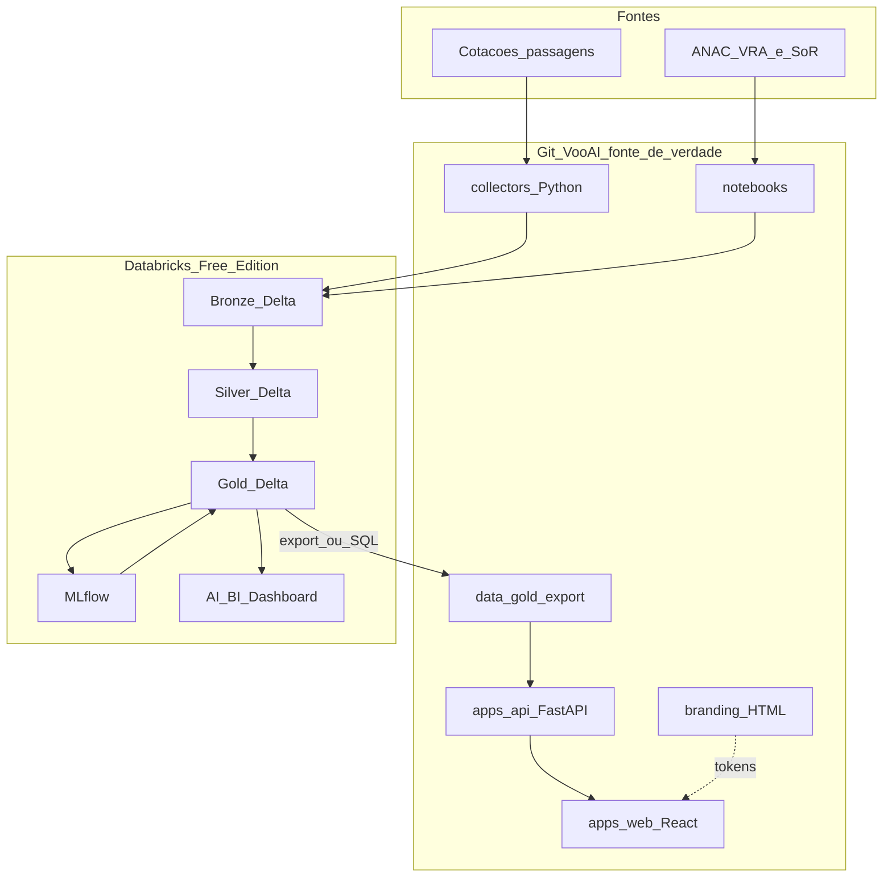

# Arquitetura VooAI

Fonte oficial do desenho. Código e documentação vivem neste Git. Databricks Free Edition = compute + Delta Lake + AI/BI Dashboard.

## Princípios

- Git é a fonte de verdade.
- Notebooks e collectors são desenvolvidos aqui e importados no workspace Free.
- A API **não** treina modelos: lê a camada Gold (export local no MVP).
- Dois consumos da Gold: dashboard acadêmico (Databricks) e produto web (FastAPI → React).
- Sem OCI, sem stacks corporativas externas ao escopo da disciplina.

## Visão ponta a ponta

## Camadas Lakehouse

| Camada | Nome no repo | Ferramenta / formato | Conteúdo | Código no git |
|--------|--------------|----------------------|----------|---------------|
| Fontes | — | Python + dados abertos | Cotações periódicas; ANAC VRA | `collectors/`, `notebooks/` |
| Bronze | **SoR** | JSON/CSV → Delta | Brutos sem alteração funcional | `data/SoR/`, notebooks 01–02 / 08 |
| Silver | **SoT** | PySpark / SQL + Delta | Datas, IATA, companhias, nulos, features | `data/SoT/`, notebook 03 / 08 |
| Gold | **Spec** | Spark + MLflow + Delta | Histórico, KPIs ANAC, previsão, recomendação | `data/Spec/`, notebooks 05–07 / 09–10 |
| Consumo A | — | Databricks AI/BI | Dashboard da disciplina | workspace Free |
| Consumo B | Spec CSV | FastAPI + React | Produto VooAI | `apps/` + `data/Spec/` |

Catálogo sugerido no Free: `vooai` / schemas `bronze`, `silver`, `gold`.

## Ponte Git ↔ Databricks Free

1. Versionar notebooks e collectors neste repositório.
2. Importar no workspace Free ([`scripts/sync_notebooks.md`](../scripts/sync_notebooks.md)).
3. Executar ingestão e gravação Delta no cluster Free.
4. Exportar Spec (Gold produto) para `data/Spec/` via [`scripts/export_gold.py`](../scripts/export_gold.py) (ou download manual / SQL warehouse).
5. Dashboard lê Gold no Databricks. A web lê só a API.

No MVP a API **não** consulta o cluster a cada request. Isso evita timeout do Free e permite demo com Spec exportada em disco.

Deploy acadêmico (local, Docker, box FourDev/SDR sem Postgres, roadmap internacional): [`deploy-academico.md`](deploy-academico.md).

## Modelagem e decisão

Duas frentes (validação temporal; métricas MAE e RMSE; R² complementar na regressão):

| Frente | Objetivo | Candidatos |
|--------|----------|------------|
| Regressão | Preço futuro ou variação com fatores do voo/compra | Linear (baseline), Random Forest, XGBoost se viável |
| Séries | Tendência e sazonalidade por rota | Baseline temporal, ARIMA/SARIMA e/ou Prophet |

Regra inicial de negócio (calibrar após EDA):

- **COMPRAR** se variação prevista ≥ +5%
- **AGUARDAR** se variação prevista ≤ −5%
- **MONITORAR** no intervalo (−5%, +5%)

Complemento: taxa de atraso, cancelamento e ranking de confiabilidade ANAC.

## Contratos da API

Detalhe em [`schemas/openapi.yaml`](../schemas/openapi.yaml). Resumo:

| Recurso | Função |
|---------|--------|
| `GET /health` | Saúde |
| `GET /routes` | Rotas do MVP |
| `GET /quotes/search` | Cotações + resumo histórico |
| `GET /recommendations/{route_id}` | Preço, variação, ação, confiança |
| `GET /reliability` | Atraso, cancelamento, ranking |
| `GET /models/metrics` | MAE / RMSE |

## Segurança e governança (MVP acadêmico)

- Sem dados pessoais; LGPD simulada.
- Segredos (token Databricks, se houver) só em `.env` local, nunca no git.
- Dicionário em [`dicionario-de-dados.md`](dicionario-de-dados.md).
- Classificação: fontes públicas / cotações de mercado; rastrear origem na Bronze.
